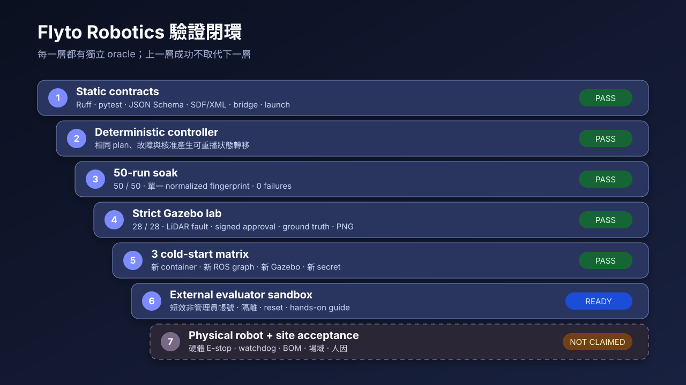
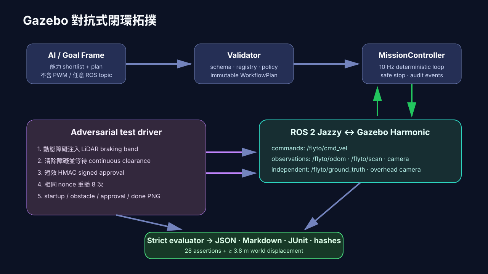

# Gazebo adversarial closed-loop test plan

## Objective

Prove that an AI-composed, multi-atom CareFlow mission can be validated,
executed in real Gazebo physics, stopped by an actual LiDAR obstacle, resumed
only after clearance and signed human approval, and audited with independent
world-motion evidence.

The target plan is:

```text
navigate(blue)
→ wait_until_clear
→ navigate(yellow)
→ ask_human(delivery.nurse_station)
→ resume(delivery.nurse_station)
→ navigate(purple)
→ safe_stop
```

The line colors are a visible route vocabulary. The physical acceptance plan
uses waypoint navigation so the test isolates orchestration, physics, sensing,
safety, approval, and evidence. Camera-based curved-line handoff remains a
separate milestone and is not silently counted as passed.

## Verification ladder

| Layer | Purpose | Oracle | Entry point |
|---|---|---|---|
| Static | Lint, schemas, assets, launch/SDF parsing | Ruff, pytest, schema validators | `make verify` |
| Deterministic | State-machine and fault behavior without ROS | Controller result and event fingerprint | `make careflow-dry-run` |
| Soak | Detect nondeterminism and intermittent policy drift | 50 identical normalized fingerprints | `make soak` |
| Gazebo lab | Exercise ROS bridge, DART physics, LiDAR, approval, replay rejection | 28 strict assertions | `make gazebo-lab` |
| Cold-start matrix | Detect startup races and hidden process state | Three isolated Docker/ROS/Gazebo runs | `make gazebo-matrix` |
| External evaluator | Validate usability and account isolation | Bounded evaluator checklist | See `EVALUATOR_GUIDE.md` |
| Physical robot | Validate real base, E-stop, site and hardware | Separate site acceptance plan | Not yet claimed |



## Reference environment

- Ubuntu 24.04 container
- ROS 2 Jazzy
- Gazebo Harmonic / Gazebo Sim 8.11
- DART physics
- `ros_gz_bridge`
- self-contained world and model assets; no online Fuel models
- ARM64 host verified; the Dockerfile is multi-architecture

The local macOS host only orchestrates Docker. ROS 2 and Gazebo execute inside
the reference Linux container.

## Scenario inputs

The versioned scenario is
`scenarios/gazebo/careflow-adversarial.json`. Its provenance set includes:

- `worlds/atomic-color-route-lab.sdf`
- `models/flyto_rover/model.sdf`
- `config/bridge.yaml`
- `examples/jobs/pharmacy-to-ward.json`
- `examples/plans/careflow-waypoints-human-gate.json`

Each report records SHA-256 digests for these inputs, the mission result, and
the image manifest.

## Runtime topology



The test driver does not merely wait for a success JSON:

1. It waits for real Gazebo and ROS topics.
2. It records initial Gazebo world pose from `/flyto/ground_truth`.
3. It moves a dynamic obstacle into the LiDAR braking band.
4. It requires an `obstacle_stop` event while velocity is held at zero.
5. It removes the obstacle and requires a continuous clearance window.
6. It waits for `human_approval_requested`.
7. It publishes one short-lived, HMAC-signed approval from
   `evaluator.gazebo`.
8. It republishes the same nonce eight times and requires rejection evidence.
9. It requires `resume_authorized`, final `safe_stop`, and mission completion.
10. It captures final Gazebo world pose and four overhead PNG frames.

The script generates a unique 256-bit approval secret for each container run,
passes it only through the process environment, and clears the shell variable
after execution. The secret is not written into results.

## Independent motion oracle

The first implementation exposed an important false positive: controller
odometry increased while the rover body barely moved because the wheel joint
axes were expressed in the wrong frame.

The current test therefore uses two separate measurements:

- mission odometry, consumed by the controller;
- Gazebo `OdometryPublisher` world pose, bridged independently on
  `/flyto/ground_truth`.

A run fails unless the Gazebo world displacement is at least 3.8 m. This
prevents wheel spin, synthetic odometry, or a controller-only result from being
reported as physical movement.

## Strict acceptance gates

One lab run must pass all 28 checks:

- result contract and terminal `succeeded`;
- `gazebo_physics=true`;
- at least one safety stop;
- completion within 90 simulated seconds;
- contiguous event sequence numbers;
- required mission, obstacle, clearance, approval, replay-rejection, resume,
  and completion events;
- required `navigate`, `wait_until_clear`, `ask_human`, `resume`, and
  `safe_stop` primitive evidence;
- actor `evaluator.gazebo`;
- final pose inside x `[4.15, 4.55]`, y `[-0.25, 0.25]`;
- startup, obstacle, approval, and completion captures;
- driver evidence contract;
- Gazebo world displacement of at least 3.8 m.

The matrix adds these gates:

- every requested run passed;
- every run has the same assertion count and all assertions passed;
- every run records at least one LiDAR stop;
- every run has a valid world displacement;
- aggregate metrics are finite and internally consistent.

## Commands

Run local verification:

```bash
make verify
make soak
```

Run one fresh Gazebo lab:

```bash
make gazebo-lab
```

Run the same strict lab and produce an uncut H.264 overhead video:

```bash
make gazebo-video
```

Run the default three-cold-start matrix:

```bash
make gazebo-matrix
```

Increase the matrix to at most 20 runs:

```bash
FLYTO_ROBOTICS_GAZEBO_RUNS=10 make gazebo-matrix
```

Pin reproducible result directory names:

```bash
FLYTO_ROBOTICS_LAB_RUN_ID=review-001 make gazebo-lab
FLYTO_ROBOTICS_MATRIX_ID=review-matrix make gazebo-matrix
```

Generated directories contain:

- `mission-result.json`: versioned controller result and audit events;
- `images/driver-manifest.json`: capture names, hashes, ground-truth poses;
- `images/*.png`: overhead startup, obstacle, approval, and completion frames;
- `video-frames/frame-*.png`: ordered source frames when video is enabled;
- `gazebo-careflow.mp4`: simulated-duration-calibrated H.264 evidence video;
- `video-probe.json`: codec, dimensions, rate, frame count, duration, and size;
- `gazebo-careflow.mp4.sha256`: video integrity hash;
- `report.json`: machine-readable strict evaluation;
- `report.md`: evaluator-readable report;
- `junit.xml`: CI-compatible result.

## Shutdown behavior

After the mission result, final zero-velocity command, and evidence writes
complete, ROS launch shuts down required processes. Headless Gazebo's rendering
server may be terminated by the outer timeout during this cleanup. A Gazebo
server exit caused by controlled post-result shutdown is not used as the pass
oracle; missing evidence or any failed report assertion still produces a
non-zero script exit.

## Non-claims

This plan does not claim:

- certified medical-device safety;
- hospital production RBAC or key custody;
- physical emergency-stop validation;
- full physical camera curve handoff;
- performance on an unspecified commercial robot;
- clinical handling of medicine, specimens, or patient data.
