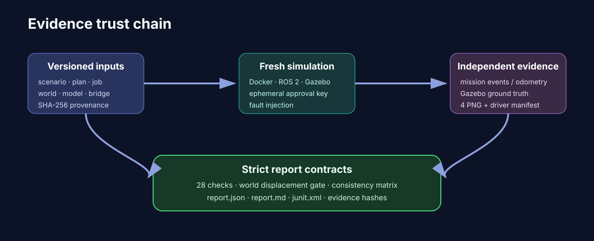

# Verified test results — 2026-07-29

## Outcome

The current CareFlow baseline passed all implemented local, deterministic, and
Gazebo closed-loop gates.

| Suite | Result | Key evidence |
|---|---:|---|
| Strict Gazebo lab | 28 / 28 checks | 18.900 s, 1 LiDAR stop, 30 contiguous events, 4.246871 m world displacement |
| Gazebo cold-start matrix | 3 / 3 runs | 28 / 28 per run, consistent assertions |
| Gazebo evidence video | PASS | 19.0 s H.264, 960×540, 22 unique source frames, 76 presentation frames |
| Deterministic soak | 50 / 50 runs | 100% pass, one normalized fingerprint |
| Evaluator sandbox unit contract | 15 / 15 tests | expiry, disable, revision, login and refresh fail-closed |

These results are evidence for the versioned synthetic scenario only.

## Strict Gazebo lab

Report:
`results/gazebo-lab/20260729T040000Z/report.json`

- scenario: `gazebo.careflow.adversarial.v1`
- status: passed
- elapsed simulation time: 18.900 s
- final controller pose: x=4.2618, y=0.0000, yaw=0.0000
- independent Gazebo world displacement: 4.246871 m
- safety stops: 1
- audit events: 30, contiguous
- captures: 4
- signed actor: `evaluator.gazebo`
- replay attempts using the accepted nonce: 8, rejected and recorded

### Captured images

The generated evidence directory contains:

1. `gazebo-startup-001.51.png` — rover at startup.
2. `gazebo-obstacle-003.52.png` — dynamic red obstacle inside the LiDAR
   braking path while the rover is stopped.
3. `gazebo-approval-012.76.png` — rover held at the approval gate.
4. `gazebo-completed-018.90.png` — rover at the purple endpoint after the
   obstacle has been moved away.

`images/driver-manifest.json` stores each image SHA-256 and the independent
ground-truth pose samples. The report also hashes the manifest.

## Uncut Gazebo evidence video

Run:
`results/gazebo-lab/video-release-20260729T004500Z/`

- strict lab: 28 / 28 checks passed
- mission elapsed time: 18.900 simulated seconds
- independent world displacement: 4.242620 m
- LiDAR safety stops: 1
- audit events: 30, contiguous
- unique Gazebo overhead frames: 22
- encoded presentation: H.264, 960×540, 4 FPS, 76 frames, 19.000 seconds
- interpolation or generated imagery: none
- MP4 SHA-256:
  `4752954bd6338f620a8607d7d03f6b264da8950f1dc77602d38fa1452c4633f8`

The recorder keeps the frames in observation order. ffmpeg calibrates their
input rate to the measured mission duration and duplicates frames only to
produce a broadly compatible 4 FPS H.264 stream. This preserves the actual
Gazebo views without inventing intermediate motion.

## Independent cold-start matrix

Report:
`results/gazebo-matrix/20260729T050000Z/report.json`

| Run | Checks | Elapsed | World displacement | Stops | Events |
|---:|---:|---:|---:|---:|---:|
| 1 | 28 / 28 | 19.001 s | 4.242893 m | 1 | 30 |
| 2 | 28 / 28 | 18.900 s | 4.241826 m | 1 | 30 |
| 3 | 28 / 28 | 19.000 s | 4.247524 m | 1 | 30 |

Aggregate:

- passed runs: 3 / 3
- elapsed min / mean / max: 18.900 / 18.967 / 19.001 s
- displacement min / max: 4.241826 / 4.247524 m
- consistent assertions: true

Each run started a new Docker container, rebuilt the ROS workspace, launched a
new Gazebo server, created a fresh ephemeral approval secret, and wrote a
separate evidence directory. This reduces the chance of process cache, old ROS
state, or a lucky startup being mistaken for repeatability.

## Deterministic 50-run soak

Report:
`results/deterministic-soak/report.json`

- passed runs: 50 / 50
- pass rate: 1.0
- deterministic: true
- unique normalized fingerprints: 1
- each run: 5.65 simulated seconds
- each run: 26 events
- each run: 2 injected safety stops
- failed runs: 0

The fingerprint normalizes non-deterministic timestamps while preserving
terminal status, ordered events, capability sequence, actor evidence, poses,
and safety counts.

## Failures found before the pass

Failed attempts were retained during development because they improved the
oracle:

1. A static obstacle could not be moved into the route, so the mission did not
   experience the intended LiDAR fault.
2. A dynamic obstacle placed too close to the rover did not establish a valid,
   repeatable braking scenario.
3. Wheel odometry advanced while the physical rover barely translated. The
   top-down image exposed this false positive.
4. The first independent ground-truth bridge configurations did not publish a
   usable pose.

Fixes:

- obstacle changed to a dynamic SDF model with explicit mass, inertia, and
  friction;
- obstacle injection changed to a stable 0.80 m lead position;
- wheel joint axes now use `expressed_in="__model__"`;
- Gazebo's independent `OdometryPublisher` is bridged as
  `/flyto/ground_truth`;
- final acceptance requires at least 3.8 m of world displacement.

The resulting test is stronger than checking controller success or odometry
alone.

## Evidence integrity

Machine-readable contracts:

- `flyto.robotics.result.v1`
- `flyto.robotics.lab-driver-evidence.v1`
- `flyto.robotics.lab-report.v1`
- `flyto.robotics.lab-matrix.v1`
- `flyto.robotics.soak-report.v1`

Reports include scenario and input hashes. JUnit files support CI ingestion.
Generated evidence remains untracked by repository policy, so evaluators
should receive an exported evidence archive or regenerate it with
`make gazebo-matrix`.

## Remaining work before a physical public demo

- choose and document the final hardware BOM;
- validate the same contract against a real robot adapter;
- add independent hardware emergency stop and watchdog acceptance;
- complete physical camera-based curved-line handoff before claiming it;
- connect approval signing to deployed Flyto authentication and RBAC;
- run site-specific obstacle, network-loss, sensor-loss, battery, and
  human-factors tests;
